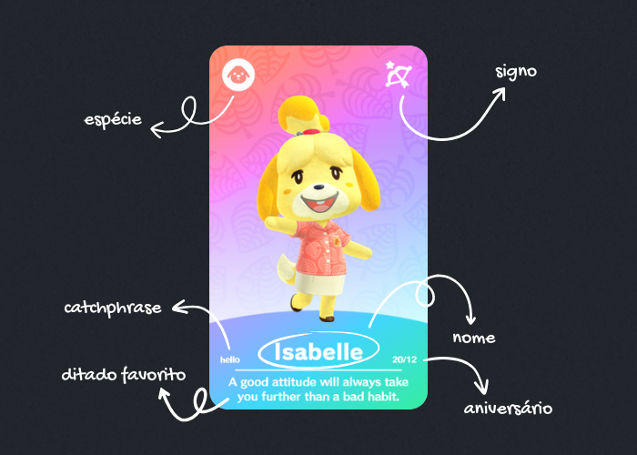

# Amiibo Card Viewer - Animal Crossing  

Este projeto é um **Visualizador de Amiibo** de **Animal Crossing**. Criado do zero, sem o uso de frameworks, com foco em **aprendizado**, ele explora conceitos de **desenvolvimento web** utilizando **HTML, CSS e JavaScript**. 

## Funcionalidades  
* Visualizar Amiibos de Animal Crossing (frente e verso)
* Exibir informações detalhadas sobre cada villager:  

## Tecnologias Utilizadas  
*   
*   
*   

## Objetivo do Projeto  
Este projeto foi criado **exclusivamente para estudo**, como parte das atividades práticas do curso **"Do Zero ao Programador Contratado"** do canal **Dev Em Dobro**. Ele tem como foco:  
* Praticar conceitos básicos de programação web
* Explorar a manipulação de eventos com JavaScript
* Trabalhar com exibição dinâmica e interatividade